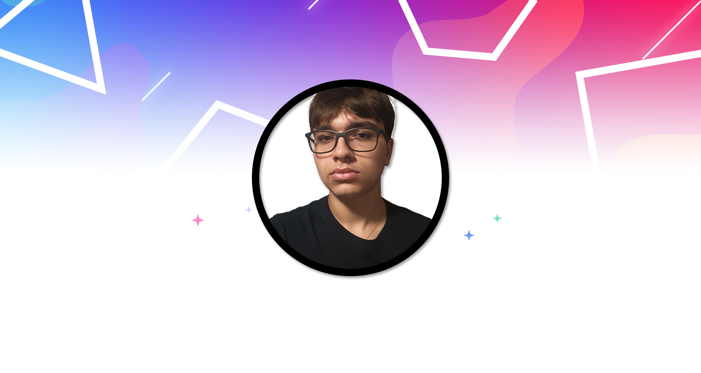

<!--
  Credit to https://github.com/tthn0/tthn0, https://github.com/blueIsaac1/blueIsaac1 and https://github.com/RenanM1214/RenanM1214 for README idea.
-->

  
  ## <h1 style="text-align: center;"> Olá, eu me chamo Pedro!  </h1>
  Seja bem-vindo ao meu perfil aqui no github. 😁

  

    

## <h3>👨‍💻 Linguagens e Frameworks</h3>

  

## <h3>⚙ Ferramentas e IDEs</h3>

  

## <h3>📧 Entre em contato! </h3>

  
  
     

  
  

<picture>
  <source media="(prefers-color-scheme: dark)" srcset="https://raw.githubusercontent.com/Pedro-B-Siqueira/Pedro-B-Siqueira/output/github-contribution-grid-snake-dark.svg">
  <source media="(prefers-color-scheme: light)" srcset="https://raw.githubusercontent.com/Pedro-B-Siqueira/Pedro-B-Siqueira/output/github-contribution-grid-snake.svg">
  
</picture>

